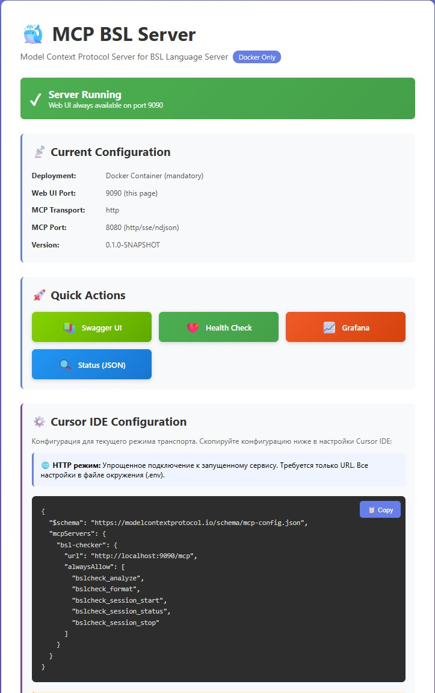

# MCP BSL Server

Сервер для проверки и форматирования кода 1C (BSL) для IDE Cursor (и другие).

## 🎯 Что это такое?

**MCP BSL Server** — это мост между вашим AI-помощником (например, в Cursor IDE) и BSL Language Server (инструментом для анализа кода 1C). 

### Для чего нужен?

- ✅ **Анализ кода 1C** — находит ошибки, предупреждения, проблемы стиля
- ✅ **Форматирование кода** — приводит код к единому стилю
- ✅ **Работа с AI** — позволяет Cursor и другим AI-помощникам проверять ваш 1C код

### Особенности проекта

- возможность тестирования MCP Tools через Swagger
- возможность мониторинга и чтения логов через дашборд Graphana
- веб-интерфейс для доступа к дополнительным функциям проекта

### Как это работает?

```
Cursor IDE → MCP BSL Server → BSL Language Server → Анализ кода 1C
```

AI-помощник может вызывать специальные инструменты (tools) для работы с вашим кодом.

## 🛠️ Доступные инструменты (MCP Tools)

Сервер предоставляет 5 инструментов для работы с кодом:

### 1. `bslcheck_analyze` — Анализ кода
Проверяет код на ошибки и предупреждения.

**Что делает:**
- Находит ошибки в синтаксисе
- Обнаруживает проблемы стиля кода
- Показывает предупреждения о потенциальных проблемах

**Пример использования в Cursor:**
> "Проверь файл Module.bsl на ошибки"

### 2. `bslcheck_format` — Форматирование кода
Приводит код к единому стилю.

**Что делает:**
- Выравнивает отступы
- Расставляет пробелы
- Организует структуру кода

**Пример использования в Cursor:**
> "Отформатируй все файлы в проекте"

**3-5 - это служебные методы
### 3. `bslcheck_session_start` — Запуск сессии
Создаёт рабочую сессию для проекта (ускоряет повторные проверки).

### 4. `bslcheck_session_status` — Статус сессии
Проверяет, активна ли сессия.

### 5. `bslcheck_session_stop` — Остановка сессии
Завершает рабочую сессию.

---

## 🚀 Быстрый старт

### Шаг 1: Установите Docker

1. Скачайте [Docker Desktop](https://www.docker.com/products/docker-desktop/)
2. Установите и запустите Docker

### Шаг 2: Клонируйте репозиторий

```powershell
# Клонируйте репозиторий
git clone https://github.com/yourusername/mcp-bsl-server.git
cd mcp-bsl-server
```

**💡 Примечание:** Замените `yourusername` на реальное имя пользователя/организации GitHub.

### Шаг 3: Соберите сервер

```powershell
# Соберите Docker-образ (без GitHub токена)
docker build -t mcp-bsl-server:latest .
```

**💡 Опционально: С GitHub токеном (быстрее, без лимитов)**

Если у вас есть GitHub токен:
```powershell
$env:GITHUB_TOKEN = (Get-Content '.secrets\github_token.txt' -Raw).Trim()
docker build --build-arg GITHUB_TOKEN=$env:GITHUB_TOKEN -t mcp-bsl-server:latest .
```

⏱️ Сборка займёт 3-5 минут (скачивается BSL Language Server ~110 МБ).

**Примечание:**
- **Без токена**: Скачивание через публичное API (может быть медленнее, есть лимит запросов)
- **С токеном**: Скачивание без лимитов (рекомендуется для частых пересборок)

### Шаг 4: Запустите сервер

```powershell
# Запустите контейнер в режиме HTTP
docker run --rm -d `
  --name mcp-bsl-server-checker `
  -e MCP_TRANSPORT=http `
  -p 9090:9090 `
  -p 9090:9090 `
  -v 'D:\My Projects\Projects 1C:/workspaces:ro' `
  mcp-bsl-server:latest
```

**⚠️ Важно:** Замените `D:\My Projects\Projects 1C` на путь к **вашей** папке с проектами 1C!

**💡 Режимы работы:**
- `MCP_TRANSPORT=http` — HTTP API + Web UI (рекомендуется для Cursor)
- `MCP_TRANSPORT=stdio` — только stdio + Web UI
- Подробнее: [docs/TRANSPORT_MODES.md](docs/TRANSPORT_MODES.md)

### Шаг 5: Откройте Web-интерфейс

Откройте в браузере: **http://localhost:9090**

Вы увидите:
- 📊 Статус сервера
- 📚 Кнопку для открытия Swagger (документация API)
- 📚 Кнопку для просмотра логов обращения к серверу в Графана
- ⚙️ Готовую конфигурацию для Cursor IDE (можно скопировать одной кнопкой)

### 📸 Стартовая страница



*Стартовая страница показывает статус сервера, текущую конфигурацию и готовую конфигурацию для Cursor IDE*

---

## 🔌 Подключение к Cursor IDE

**⚠️ Важно:** Убедитесь, что контейнер `mcp-bsl-server-checker` запущен (см. Шаг 4)!

1. **Убедитесь, что контейнер запущен:**
   ```powershell
   docker ps --filter "name=mcp-bsl-server-checker"
   ```
   Если контейнер не запущен, вернитесь к **Шагу 4**.

2. Откройте **http://localhost:9090**

3. Найдите блок **"⚙️ Cursor IDE Configuration"**


**💡 Как это работает:**
- Cursor подключается к **уже запущенному** контейнеру `mcp-bsl-server-checker`
- Используется `docker exec` вместо `docker run` (быстрее и эффективнее)
- Web UI остаётся доступным на http://localhost:9090

---

## 📖 Использование в Cursor

После подключения вы можете давать команды AI-помощнику:

### Примеры команд:

**Анализ:**
- "Проверь файл Module.bsl на ошибки"
- "Найди проблемы в проекте D:\Projects\MyProject"
- "Покажи все предупреждения в коде"

**Форматирование:**
- "Отформатируй файл Form.bsl"
- "Приведи все файлы проекта к единому стилю"

**Работа с сессиями:**
- "Создай сессию для проекта D:\Projects\MyProject"
- "Проверь статус сессии abc-123"

---

## 🔧 Управление сервером

### Просмотр логов

```powershell
docker logs -f mcp-bsl-server-checker
```

### Остановка сервера

```powershell
docker stop mcp-bsl-server-checker
```

### Перезапуск сервера

```powershell
docker restart mcp-bsl-server-checker
```

### Удаление контейнера

```powershell
docker stop mcp-bsl-server-checker
docker rm mcp-bsl-server-checker
```

### Запуск с Grafana (для просмотра логов и метрик)

Для запуска с полным стеком мониторинга (Grafana + Loki + Prometheus):

```powershell
# Установите GitHub токен
$env:GITHUB_TOKEN = (Get-Content '.secrets\github_token.txt' -Raw).Trim()

# Запустите весь стек через docker-compose
docker-compose up -d

# Доступные адреса:
# - MCP Server: http://localhost:9090
# - Grafana: http://localhost:3000 (без авторизации)
# - Дашборд логов: http://localhost:3000/d/mcp-bsl-logs
# - Prometheus: http://localhost:9091
```

**Grafana** по умолчанию работает **без авторизации**. Просто откройте http://localhost:3000 и сразу увидите интерфейс.

Дефолтный дашборд "**MCP BSL Server - Логи**" автоматически показывает:
- Временной график логов по уровням (INFO, WARN, ERROR)
- Все логи с возможностью поиска и фильтрации
- Распределение логов по уровням (круговая диаграмма)
- Только ошибки и предупреждения

**Включение авторизации** (опционально):
Если нужна авторизация, отредактируйте `grafana/grafana.ini`:
```ini
[auth.anonymous]
enabled = false  # Было: true
```
Перезапустите: `docker-compose restart grafana`. Логин: `admin`, пароль: `admin`.

**Что запустится:**
- ✅ MCP BSL Server (порт 9090)
- ✅ Grafana (порт 3000) — графический интерфейс
- ✅ Loki (порт 3100) — сбор логов
- ✅ Prometheus (порт 9091) — сбор метрик

**Остановка стека:**
```powershell
docker-compose down
```

---

## ❓ Решение проблем

### Сервер не запускается

**Проблема:** `Error: Cannot connect to the Docker daemon`
**Решение:** Убедитесь, что Docker Desktop запущен.

---

**Проблема:** `Error: port is already allocated`
**Решение:** Порт 9090 уже занят. Остановите другие приложения или измените порт:
```powershell
docker run --rm -d `
  --name mcp-bsl-server-checker `
  -p 9091:9090 `
  -p 9091:9090 `
  ... (остальные параметры)
```

---

**Проблема:** `Permission denied` при доступе к файлам
**Решение:** 
1. Откройте Docker Desktop
2. Settings → Resources → File Sharing
3. Добавьте путь к вашей папке с проектами

---

### BSL Language Server не скачивается

**Проблема:** `API rate limit exceeded` при сборке Docker-образа
**Решение:** GitHub ограничивает количество запросов без токена (60 в час). Используйте GitHub токен.

**Проблема:** `404 Not Found` или `curl failed` при сборке
**Решение:** Проблема с сетью или GitHub. Попробуйте позже или используйте токен.

#### Как создать GitHub токен (опционально):

1. Откройте https://github.com/settings/tokens
2. **Generate new token → Fine-grained token**
3. **Repository access:** Public Repositories (read-only)
4. **Permissions:**
   - Contents: Read
   - Metadata: Read
5. Скопируйте токен в `.secrets/github_token.txt`
6. Пересоберите образ с токеном:
   ```powershell
   $env:GITHUB_TOKEN = (Get-Content '.secrets\github_token.txt' -Raw).Trim()
   docker build --build-arg GITHUB_TOKEN=$env:GITHUB_TOKEN -t mcp-bsl-server:latest .
   ```

**Примечание:** Токен нужен только для сборки, он не сохраняется в образе.

---

### Cursor не видит MCP сервер

**Решение:**
1. Проверьте, что контейнер запущен: `docker ps`
2. Проверьте конфигурацию в `cline_mcp_settings.json`
3. Перезапустите Cursor IDE
4. Проверьте логи: `docker logs mcp-bsl-server-checker`

---

## 📊 Web-интерфейс

После запуска доступны следующие страницы:

| Страница | URL | Описание |
|----------|-----|----------|
| **Главная** | http://localhost:9090 | Статус сервера + конфигурация для Cursor |
| **Swagger UI** | http://localhost:9090/swagger-ui | Документация и тестирование API |
| **Health Check** | http://localhost:9090/actuator/health | Проверка работоспособности |
| **Grafana** | http://localhost:3000 | Логи и метрики (без авторизации по умолчанию) |
| **Дашборд логов** | http://localhost:3000/d/mcp-bsl-logs | Дашборд с логами MCP сервера |

**💡 Примечание:** Grafana доступна только при запуске через `docker-compose up` (см. раздел "Разработка")

---

## 📚 Дополнительная документация

Для разработчиков и продвинутых пользователей:

- [docs/TRANSPORT_MODES.md](docs/TRANSPORT_MODES.md) — **Режимы работы MCP сервера** (stdio, http, sse, ndjson)
- [TECHNICAL.md](TECHNICAL.md) — Техническая документация (API, архитектура, конфигурация)
- [docs/CURSOR_INTEGRATION.md](docs/CURSOR_INTEGRATION.md) — Подробная интеграция с Cursor
- [docs/ARCHITECTURE.md](docs/ARCHITECTURE.md) — Архитектура сервера
- [docs/WEB_UI.md](docs/WEB_UI.md) — Описание Web-интерфейса
- [mcp-config-examples.md](mcp-config-examples.md) — Примеры конфигураций

---

## 🤝 Поддержка

**Проблемы и вопросы:**
- GitHub Issues: [создать issue](https://github.com/yourusername/mcp-bsl-server/issues)

**Полезные ссылки:**
- [BSL Language Server](https://github.com/1c-syntax/bsl-language-server)
- [Model Context Protocol](https://modelcontextprotocol.io/)
- [Cursor IDE](https://cursor.sh/)

---

## 📝 Лицензия

MIT License

---

**Версия:** 0.1.0  
**Последнее обновление:** Октябрь 2024
